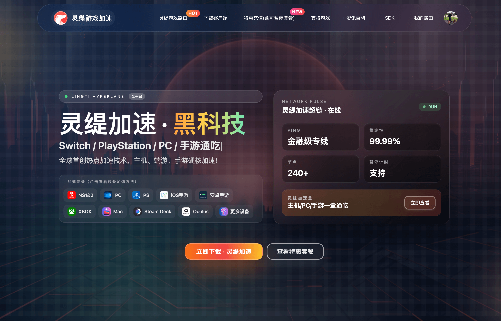
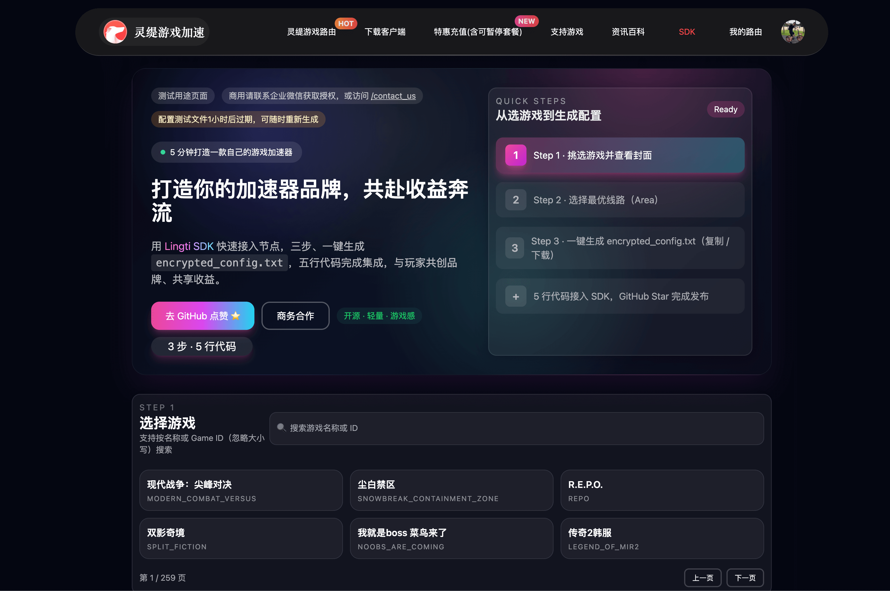

# Lingti SDK

English | [简体中文](README.zh-CN.md)

A lightweight C SDK for game traffic tunneling and network acceleration with real-time traffic monitoring.

<p align="center">
  <a href="https://game.lingti.com" style="text-decoration:none">
    
    <br /><em>Click to open the Lingti accelerator homepage</em>
  </a>
</p>

## Overview

Lingti SDK is a high-performance network tunneling library designed for game traffic optimization. It provides a simple C API for integrating network acceleration capabilities into games and applications, featuring real-time traffic monitoring, intelligent routing, and cross-platform support.

## Installation

### Download Required Files

The SDK is open source and available at: **https://github.com/ruilisi/lingti-sdk**

**Pre-compiled DLL/lib files for each SDK version are available in the [GitHub Releases](https://github.com/ruilisi/lingti-sdk/releases) section.**

Each release includes:

- `lingti_sdk.dll` - Main SDK library (13MB)
- `lingti_sdk.lib` - Import library for linking (8.6KB)
- `lingti_sdk.h` - C header file with API declarations
- `lingti_sdk.def` - Module definition file

**Note:** The `lingtiwfp64.sys` Windows driver file is included in the repository (not in releases, as it rarely changes). This file **must be placed in the same directory as your compiled executable** for the SDK to function properly on Windows.

### Understanding DLL vs LIB

#### What is the DLL?

The **DLL (Dynamic Link Library)** file (`lingti_sdk.dll`, 13MB) contains all the actual compiled code:

- Complete Go runtime and garbage collector
- All SDK functionality and business logic
- Network tunneling implementation
- Required at **runtime** when your application executes

**Runtime requirement:** `lingti_sdk.dll` must be present when your application runs. Place it:

- In the same directory as your `.exe` file (recommended)
- In a system directory (e.g., `C:\Windows\System32`)
- In any directory listed in your system's PATH environment variable

#### What is the LIB?

The **LIB (Import Library)** file (`lingti_sdk.lib`, 8.6KB) is much smaller because it contains only:

- Stub code with function name references
- Metadata telling the linker where to find functions in the DLL
- Import table information

**The small size (8.6KB vs 13MB) is normal and correct!** The import library only contains references to the 9 exported functions, not the actual implementation code.

**Compile-time requirement:** `lingti_sdk.lib` is only needed when compiling/linking your application with MSVC. It's not needed at runtime.

#### When to Use Each File

| File             | Used When                | Purpose                                                     |
| ---------------- | ------------------------ | ----------------------------------------------------------- |
| `lingti_sdk.dll` | Runtime (always)         | Contains all actual code, must be distributed with your app |
| `lingti_sdk.lib` | Compile-time (MSVC only) | Tells linker how to find DLL functions                      |
| `lingti_sdk.h`   | Compile-time (always)    | Provides function declarations for your C code              |

#### Compiler-Specific Usage

**MSVC (Visual Studio):**

```bash
# Compilation requires .lib file
cl your_app.c lingti_sdk.lib

# Runtime requires .dll file in same directory as .exe
your_app.exe    # needs lingti_sdk.dll present
```

**MinGW/GCC:**

```bash
# Can link directly against .dll (no .lib needed)
gcc your_app.c -L. -llingti_sdk -o your_app.exe

# Runtime requires .dll file
./your_app.exe  # needs lingti_sdk.dll present
```

#### Distribution Checklist

When distributing your application, include:

- ✅ Your compiled `.exe` file
- ✅ `lingti_sdk.dll` (13MB - **required at runtime**)
- ✅ `lingtiwfp64.sys` (Windows driver - **required at runtime**)
- ❌ `lingti_sdk.lib` (NOT needed by end users)
- ❌ `lingti_sdk.h` (NOT needed by end users)

## Features

- **Simple C API** - Clean interface with start/stop service management
- **Asynchronous Operation** - Non-blocking service execution in background threads
- **Real-time Monitoring** - Track transmitted/received bytes and packets
- **DNS Management** - Built-in DNS cache control
- **Cross-platform** - Windows (DLL), Linux, and macOS support
- **Encrypted Configuration** - Secure encrypted config via string or file
- **Traffic Statistics** - Byte and packet-level monitoring
- **Error Handling** - Comprehensive error codes and messages

## Quick Start

### Minimum Code(5 lines) to work

```c
#include "../lingti_sdk.h"
int main() {
    StartTun2RWithConfigFile("encrypted_config.txt");
    return 0;
}
```

### Basic Usage

```c
#include <stdio.h>
#include "../lingti_sdk.h"

#ifdef _WIN32
#include <windows.h>
#define SLEEP(ms) Sleep(ms)
#else
#include <unistd.h>
#define SLEEP(ms) usleep((ms) * 1000)
#endif

int main() {
    printf("Lingti SDK Example\n");
    printf("==================\n\n");

    // Check SDK version
    char* version = GetSDKVersion();
    printf("SDK Version: %s\n\n", version);
    FreeString(version);

    // Path to encrypted config file
    // For encryption details, see API.md
    const char* configFile = "encrypted_config.txt";

    printf("Starting service from config file...\n");
    int result = StartTun2RWithConfigFile(configFile);

    if (result != 0) {
        char* error = GetLastErrorMessage();
        printf("Failed to start service (code %d): %s\n", result, error);
        FreeString(error);
        return 1;
    }

    printf("Service started successfully!\n\n");

    // Check service status
    if (IsServiceRunning()) {
        printf("Service status: RUNNING\n\n");
    }

    // Monitor traffic for 30 seconds
    printf("Monitoring traffic for 30 seconds...\n");
    printf("Press Ctrl+C to stop early\n\n");

    for (int i = 0; i < 30; i++) {
        unsigned long long txBytes, rxBytes;
        GetTrafficStats(&txBytes, &rxBytes, NULL, NULL);

        printf("\r[%02d/%02d] TX: %llu bytes | RX: %llu bytes",
               i + 1, 30, txBytes, rxBytes);
        fflush(stdout);

        SLEEP(1000);
    }

    printf("\n\n");

    // Stop the service
    printf("Stopping service...\n");
    result = StopTun2R();

    if (result == 0) {
        printf("Service stopped successfully!\n");
    } else {
        char* error = GetLastErrorMessage();
        printf("Failed to stop service (code %d): %s\n", result, error);
        FreeString(error);
    }

    printf("\nExample completed. See API.md for detailed documentation.\n");

    return 0;
}
```

### Encrypted Config

The SDK **only** supports encrypted configuration for enhanced security.

To obtain an encrypted configuration:

1. Visit https://game.lingti.com/sdk
2. Select your game (需要加速的游戏)
3. Select your tunnel line (线路)
4. Copy the provided encrypted_config string

The encrypted_config is a Base64-encoded string that contains all necessary tunnel settings.

Click the image below to open the generator and download your `encrypted_config` file:

<p align="center">
  <a href="https://game.lingti.com/sdk" style="text-decoration:none">
    
    <br /><em>Click the image to open the encrypted_config generator</em>
  </a>
</p>

## API Reference

### Core Functions

- `StartTun2RWithConfigFile(const char* configPath)` - Start service from encrypted config file (base64 encoded text)
- `StopTun2R(void)` - Stop the service gracefully
- `IsServiceRunning(void)` - Check if service is running

### Monitoring Functions

- `GetTrafficStats(...)` - Get current traffic statistics
- `GetSDKVersion(void)` - Get SDK version string
- `GetLastErrorMessage(void)` - Get last error message
- `FlushDNSCache(void)` - Flush local DNS cache

### Memory Management

- `FreeString(char* s)` - Free strings returned by SDK functions

## Error Codes

- `LINGTI_SUCCESS (0)` - Operation successful
- `LINGTI_ERR_NULL_CONFIG (-1)` - Invalid/null configuration
- `LINGTI_ERR_JSON_PARSE (-2)` - JSON parsing error
- `LINGTI_ERR_ALREADY_RUN (-3)` - Service already running
- `LINGTI_ERR_LOAD_CONFIG (-4)` - Failed to load config file
- `LINGTI_ERR_NOT_RUNNING (-1)` - Service not running

## Building

### Using the Makefile (Recommended)

Build the example with all required files:

```bash
make example
```

This will create an `example/` directory containing:

- `example.exe` - Compiled executable
- `lingtiwfp64.sys` - Windows driver file
- `lingti_sdk.dll` - SDK library

Clean the build:

```bash
make clean
```

The Makefile automatically detects your platform:

- **Windows**: Uses native gcc or MinGW
- **Linux/macOS**: Uses MinGW cross-compiler (install with `brew install mingw-w64`)

### Manual Compilation

#### Windows (MinGW)

```bash
gcc your_app.c -L. -llingti_sdk -o your_app.exe
```

#### Windows (MSVC)

```bash
cl your_app.c lingti_sdk.lib
```

#### Linux/macOS (Cross-compile)

```bash
x86_64-w64-mingw32-gcc your_app.c lingti_sdk.lib -o your_app.exe
```

### Node.js package (lingti-sdk) (Recommended)

- Windows is required to run the native addon; on macOS/Linux the install succeeds but skips the native build.
- Install from npm:

```bash
npm install lingti-sdk
```

```javascript
const lingti = require('lingti-sdk');
if (lingti.isAddonAvailable()) {
  lingti.startTun2RWithConfigFile('encrypted_config.txt');
}
```

## Examples

See the `examples/` directory for complete working examples:

- `sdk_example.c` - Basic SDK usage demonstration
- `sdk_example_min.c` - Minimal 5-line example

## License

Copyright (c) 2025 Ruilisi

## Version

Current version: 1.4.3

## Demo Video

<p align="center">
  <a href="https://www.bilibili.com/video/BV1Y4SiBLEWB/?share_source=copy_web&vd_source=6b41ec669aaccb71ab94fe20193f3cd1" style="text-decoration:none">
    
    <br /><em>Click to watch the tutorial on Bilibili</em>
  </a>
</p>

## Contact Us

<p align="center">
  <a href="https://game.lingti.com/contact_us" style="text-decoration:none">
    
    <br /><em>Scan or click to reach the Lingti team</em>
  </a>
</p>
